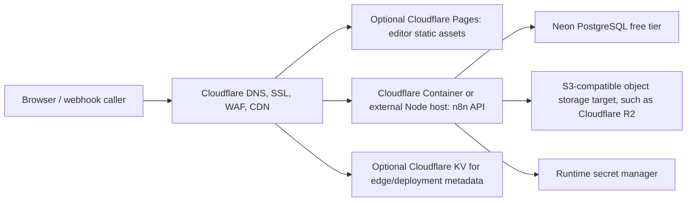

# Cloudflare deployment architecture for n8n

This document explains the most Cloudflare-native deployment shape for the n8n
source tree. It is a migration plan and deployment reference, not a claim that
n8n can run unchanged on Cloudflare Workers.

## Executive summary

The full n8n server cannot run directly on Cloudflare Workers. n8n depends on a
long-lived Node.js process, persistent database connections, webhook listeners,
Server-Sent Events and WebSocket-style push behavior, filesystem-backed user
state, optional child processes, task runners, dynamic package loading, and
binary modules such as SQLite. Workers have a request-scoped execution model and
do not provide the complete Node.js server runtime that n8n requires.

The closest production-ready Cloudflare-native architecture is:



If Cloudflare Containers are unavailable on the account, keep the same topology
but run the API on a free or low-cost Node-capable host, such as Oracle Cloud
Free VM, Fly.io, Render, Railway credits, or a small VPS, and place Cloudflare in
front of it with DNS, SSL, Zero Trust, Tunnel, CDN, and WAF.

A fully free production deployment cannot be guaranteed because the n8n API needs
a long-running Node.js runtime. Free compute availability changes by provider and
may not satisfy uptime, memory, storage, outbound networking, or execution
requirements.

## Non-goals

This guide does not:

- Port the n8n API or worker runtime to Cloudflare Workers.
- Replace n8n's database layer with Cloudflare D1.
- Replace process memory, execution state, or database-backed state with
  Cloudflare KV.
- Add a new Cloudflare R2 binary-data provider implementation.
- Change n8n's package-manager policy or make npm a supported root workspace
  installer.
- Change the existing Docker images or fix unrelated Docker build issues.
- Promise that Cloudflare free-tier products are sufficient for every production
  n8n workload.

## Recommended minimal production architecture

Use this shape for the lowest-risk Cloudflare deployment:

- Edge: Cloudflare DNS, proxied SSL, WAF rules, and optionally Zero Trust.
- API and editor: the official n8n Node.js server running in a Cloudflare
  Container or another Node-capable host.
- Database: PostgreSQL, such as Neon PostgreSQL free tier for small deployments.
- Binary data: n8n's supported object-storage mode after validating the chosen
  n8n version against the S3-compatible settings required by Cloudflare R2.
- Secrets: the secret-management mechanism of the selected API runtime.
- Execution mode: regular/native execution first. Queue mode needs Redis or
  another supported queue dependency and is not a Cloudflare-free-tier-only
  architecture.

Serving the editor from the n8n server is the lowest-risk option. Splitting the
editor to Cloudflare Pages can be useful, but it requires validating API base
URLs, auth cookies, CORS, push/SSE behavior, webhook URLs, and reverse-proxy
routing.

## Repository architecture relevant to hosting

- Root workspace: pnpm monorepo requiring Node `>=22.22` and pnpm `>=10.22.0`.
- Backend server and CLI: `packages/cli`.
- Core execution engine and binary-data abstractions: `packages/core`.
- Workflow model and runtime types: `packages/workflow`.
- Editor UI: `packages/frontend/editor-ui`.
- Built-in nodes: `packages/nodes-base`.

## Docker inventory

This guide does not replace the existing Docker packaging. The relevant Docker
entry points are:

- Root development/build image: `Dockerfile`.
- Published n8n image: `docker/images/n8n/Dockerfile`.
- Base image: `docker/images/n8n-base/Dockerfile`.
- Task runner image: `docker/images/runners/Dockerfile`.
- Distroless task runner image: `docker/images/runners/Dockerfile.distroless`.
- Engine image: `docker/images/engine/Dockerfile`.
- Testing and benchmark compose files under `packages/testing` and
  `packages/@n8n/benchmark`.

## Why Workers are incompatible

| Requirement | n8n behavior | Worker conflict |
| --- | --- | --- |
| Node runtime | Uses Node built-ins including `fs`, `path`, streams, buffers, crypto, process state, and dynamic module loading | Workers only provide a compatibility subset, not a full Node server process |
| Process lifetime | Main process owns webhook server, activation state, execution lifecycle, and runners | Workers are request-scoped and can be evicted between requests |
| HTTP server | n8n starts an Express-style Node server and manages ports | Workers receive fetch events; they do not bind a long-running Node listener |
| Realtime updates | Editor depends on push/SSE behavior for execution status and UI updates | Worker limits and request lifecycle are a poor fit for long-lived push channels |
| Filesystem | Default config, encryption key persistence, static cache, and filesystem binary storage use disk | Workers do not provide a persistent POSIX filesystem |
| Database | Production uses PostgreSQL, development can use SQLite | SQLite native modules and long-lived DB assumptions do not map to Workers; use PostgreSQL from a Node host |
| Background work | Workflow execution can continue independently from a single browser request | Workers are not a general-purpose background process runtime |
| Child processes | Some package scripts, node behaviors, and runners may invoke subprocesses | Workers do not support arbitrary child process execution |
| Dynamic nodes | n8n loads node packages and credentials from the filesystem/runtime package graph | Worker bundles are static and do not support the same package-loading model |

## Recommended deployment modes

### Mode A: Cloudflare Container API with optional Pages frontend

Use this mode when Cloudflare Containers are available.

- API: run the official n8n server in a Cloudflare Container built from the
  repository Docker image.
- Frontend: serve the editor from the n8n API container by default. Publish the
  editor to Cloudflare Pages only after validating auth, API routing, CORS, and
  push/SSE behavior.
- Database: Neon PostgreSQL free tier for small deployments, or any supported
  managed PostgreSQL service.
- Binary data: a supported n8n object-storage configuration, validated against
  Cloudflare R2 if R2 is the selected S3-compatible target.
- Secrets: Cloudflare-managed secrets for the container runtime when available.
- Execution mode: start with regular/native execution. Queue mode requires Redis
  or another supported queue service.

### Mode B: External Node host plus Cloudflare edge services

Use this mode when Containers are unavailable.

- Run the n8n API on a Node-capable host or VM.
- Expose the API through Cloudflare Tunnel or proxied DNS.
- Serve editor assets through the n8n server unless there is a tested reason to
  split them to Pages.
- Use PostgreSQL and object storage the same way as Mode A.
- Store secrets in the external host's secret manager, not in the repository.

## Storage mapping

n8n already has non-filesystem binary-data abstractions. Cloudflare R2 should be
treated as an S3-compatible object-storage target, not as a Worker binding for
the n8n API. Before production use, verify that the n8n version being deployed
supports the required object-storage settings for endpoint, region, bucket,
credentials, TLS behavior, and path-style addressing.

Keep filesystem storage for local development unless you are explicitly testing
object storage.

```bash
# Local development only
N8N_DEFAULT_BINARY_DATA_MODE=filesystem

# Production database baseline
DB_TYPE=postgresdb
DB_POSTGRESDB_SSL_ENABLED=true
```

Do not commit R2 access keys or generated credentials.

## Cache mapping

n8n's in-process caches are runtime-local and should remain in-process for a
single API container. Cloudflare KV is suitable for edge metadata, deployment
metadata, static routing hints, or optional integrations, but it is not a
drop-in replacement for process memory, workflow execution state, queue state,
or relational database state.

## Secrets mapping

Use the secret-management mechanism for the selected API runtime: Cloudflare
managed secrets for Cloudflare-hosted runtimes, or the external host's secret
manager when the API runs outside Cloudflare.

Store at least:

- `N8N_ENCRYPTION_KEY`
- database user, password, host, database, and connection URL when used
- object-storage access key and secret
- OAuth client secrets
- webhook base URL settings
- license and enterprise variables, when applicable

## Environment example

This is a minimal production-oriented environment shape. Replace all placeholder
values in the runtime secret manager; do not commit a populated `.env` file.

```bash
N8N_HOST=n8n.example.com
N8N_PROTOCOL=https
N8N_PORT=5678
WEBHOOK_URL=https://n8n.example.com/
N8N_EDITOR_BASE_URL=https://n8n.example.com/
N8N_ENCRYPTION_KEY=replace-with-stable-secret

DB_TYPE=postgresdb
DB_POSTGRESDB_HOST=replace-with-neon-host
DB_POSTGRESDB_PORT=5432
DB_POSTGRESDB_DATABASE=n8n
DB_POSTGRESDB_USER=n8n
DB_POSTGRESDB_PASSWORD=replace-with-secret
DB_POSTGRESDB_SSL_ENABLED=true
```

## Package manager policy

This repository is pnpm-first. The root workspace currently requires pnpm for
installing, building, and developing n8n. Supporting npm as a root workspace
installer would be a separate repository-wide policy and tooling change, not
part of Cloudflare hosting documentation.

## Local development without Docker

The repository already supports local development without Docker for the core
application path:

```bash
pnpm install
pnpm build
pnpm dev
```

Use SQLite for local development unless you need to reproduce PostgreSQL-specific
behavior. Use PostgreSQL locally or through Neon when validating production-like
connection behavior.

## Validation checklist before deploying

1. Confirm the branch builds with Node `>=22.22` and pnpm `>=10.22.0`.
2. Run package-level lint and typecheck for changed packages.
3. Build production assets.
4. Confirm `N8N_ENCRYPTION_KEY` is stable and backed up.
5. Confirm the external URL and webhook URL match the Cloudflare hostname.
6. Confirm PostgreSQL SSL requirements for the managed database.
7. Confirm object-storage endpoint, credentials, addressing mode, and CORS.
8. Confirm webhook requests can reach the API origin through Cloudflare.
9. Confirm editor push/SSE updates work through the selected proxy path.
10. Confirm credential encryption, workflow execution, execution history, binary
    upload/download, and authentication flows.

## Migration plan

1. Keep the official Node server as the API runtime; do not attempt a Worker
   port of `packages/cli`.
2. Start with the editor served by the n8n server. Split static assets to Pages
   only after validating auth, API, and realtime behavior.
3. Configure PostgreSQL for production and SQLite for local development.
4. Validate object-storage compatibility before migrating large binary-data
   workloads to an S3-compatible target such as R2.
5. Add Cloudflare-specific environment examples and validation scripts outside
   runtime packages so core n8n behavior remains unchanged.
6. Validate webhook execution, credential encryption, workflow execution,
   executions list, API routes, editor authentication, and binary-data download.
7. Document any provider-specific limits discovered during a real deployment,
   especially memory, cold starts, request duration, and outbound networking.

## Incompatible modules and platform features

The following categories block a direct Worker deployment:

- Native Node modules such as SQLite bindings.
- Filesystem-dependent code paths for storage, settings, static cache, dynamic
  node loading, and generated runtime files.
- Long-lived HTTP server startup and port binding.
- Background execution and task-runner processes.
- Dynamic node loading and package resolution from disk.
- APIs that rely on `process`, `require.cache`, streams, and Node-specific
  networking behavior.

## Closest free-tier architecture

For a free-oriented setup, use Neon PostgreSQL free tier and Cloudflare free DNS,
SSL, CDN, WAF basics, Pages, R2 free allowance, and Zero Trust where available.
The API still needs a real Node runtime: Cloudflare Container when available, or
an external free VM/compute provider when it is not.
