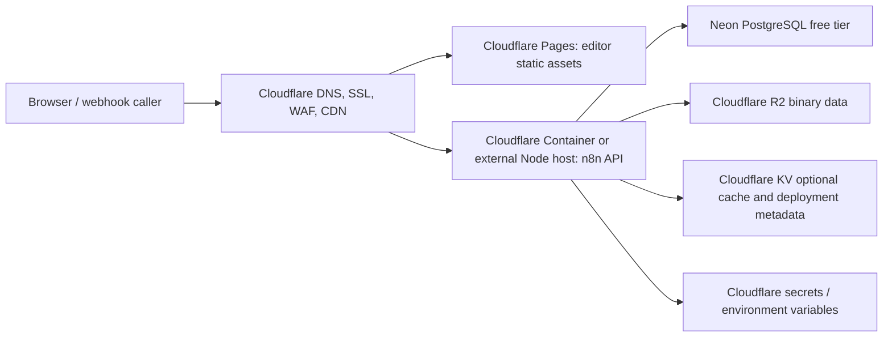

# Cloudflare deployment architecture for n8n

This document explains the most Cloudflare-native deployment shape for the n8n
source tree. It is intentionally a migration plan and deployment reference, not
a claim that n8n can run unchanged on Cloudflare Workers.

## Executive summary

The full n8n server cannot run directly on Cloudflare Workers. n8n depends on a
long-lived Node.js process, persistent database connections, webhook listeners,
Server-Sent Events and WebSocket-style push behavior, filesystem-backed user
state, optional child processes, task runners, and binary modules such as
SQLite. Workers have a request-scoped execution model and do not provide the
complete Node.js runtime that the n8n server requires.

The closest production-ready Cloudflare-native architecture is:



If Cloudflare Containers are unavailable on the account, keep the same topology
but run the API on a free or low-cost Node-capable host, such as Oracle Cloud
Free VM, Fly.io, Render, Railway credits, or a small VPS, and place Cloudflare in
front of it with DNS, SSL, Zero Trust, Tunnel, CDN, and WAF.

## Repository architecture relevant to hosting

- Root workspace: pnpm monorepo requiring Node `>=22.22` and pnpm `>=10.22.0`.
- Backend server and CLI: `packages/cli`.
- Core execution engine and binary-data abstractions: `packages/core`.
- Workflow model and runtime types: `packages/workflow`.
- Editor UI: `packages/frontend/editor-ui`.
- Built-in nodes: `packages/nodes-base`.
- Docker images: root `Dockerfile`, `docker/images/n8n-base`,
  `docker/images/n8n`, `docker/images/runners`, `docker/images/engine`, and
  testing/benchmark compose files.

## Why Workers are incompatible

| Requirement | n8n behavior | Worker conflict |
| --- | --- | --- |
| Node runtime | Uses Node built-ins including `fs`, `path`, streams, buffers, crypto, process state, and dynamic module loading | Workers only provide a compatibility subset, not a full Node server process |
| Process lifetime | Main process owns webhook server, activation state, execution lifecycle, and runners | Workers are request-scoped and can be evicted between requests |
| HTTP server | n8n starts an Express-style Node server and manages ports | Workers receive fetch events; they do not bind a long-running Node listener |
| Realtime updates | Editor depends on push/SSE behavior for execution status and UI updates | Worker limits and request lifecycle are a poor fit for long-lived push channels |
| Filesystem | Default config, encryption key, static cache, and filesystem binary storage use disk | Workers do not provide a persistent POSIX filesystem |
| Database | Production uses PostgreSQL, development can use SQLite | SQLite native module and long-lived DB assumptions do not map to Workers; use PostgreSQL over a Node host |
| Background work | Workflow execution can continue independently from a single browser request | Workers are not a general-purpose background process runtime |
| Child processes | Some package scripts, node behaviors, and runners may invoke subprocesses | Workers do not support arbitrary child process execution |

## Recommended deployment modes

### Mode A: Cloudflare Container API plus Pages frontend

Use this mode when Cloudflare Containers are available.

- Frontend: build `packages/frontend/editor-ui` and publish static assets to
  Cloudflare Pages.
- API: run the official n8n server in a Cloudflare Container built from the
  repository Docker image.
- Database: Neon PostgreSQL free tier.
- Binary data: S3-compatible object storage using Cloudflare R2.
- Secrets: Cloudflare secret variables for encryption key, database password,
  R2 credentials, and OAuth credentials.
- Execution mode: start with regular/native execution. Queue mode needs Redis
  or another supported queue service and is not free-tier Cloudflare-native.

### Mode B: External Node host plus Cloudflare edge services

Use this mode when Containers are unavailable.

- Run the n8n API on a Node-capable host or VM.
- Expose the API through Cloudflare Tunnel or proxied DNS.
- Serve editor assets through the n8n server or optionally split them to Pages.
- Use Neon PostgreSQL and R2 the same way as Mode A.

## Storage mapping

n8n already has non-filesystem binary-data abstractions. For Cloudflare R2, use
R2's S3-compatible API and configure n8n's external object-storage environment
variables. Keep filesystem storage only for local development.

Recommended production intent:

```bash
N8N_DEFAULT_BINARY_DATA_MODE=filesystem # local development only
DB_TYPE=postgresdb
DB_POSTGRESDB_SSL_ENABLED=true
```

For production R2, configure the S3-compatible object store variables supported
by the n8n version you deploy, using the R2 endpoint for your account and a
private bucket. Do not commit access keys.

## Cache mapping

n8n's in-process caches are runtime-local and should remain in-process for a
single API container. Cloudflare KV is suitable for deployment metadata,
edge-side cache keys, and lightweight optional integrations, but it is not a
drop-in replacement for process memory or database-backed execution state.

## Secrets mapping

Use Cloudflare secrets or your Node host's secret manager for:

- `N8N_ENCRYPTION_KEY`
- database password / connection URL
- R2 access key and secret
- OAuth client secrets
- webhook base URL settings
- license and enterprise variables, when applicable

## Local development without Docker

The repository already supports local development without Docker for the core
application path:

```bash
pnpm install
pnpm build
pnpm dev
```

Use SQLite for local development unless you need to reproduce PostgreSQL-specific
behavior. Use `pnpm` for repository work. npm is useful only for consumers of
published packages; this workspace intentionally blocks npm installs at the
root.

## Validation checklist before deploying

1. Confirm the branch builds with Node `>=22.22` and pnpm `>=10.22.0`.
2. Run package-level lint and typecheck for changed packages.
3. Build production assets.
4. Confirm `N8N_ENCRYPTION_KEY` is stable and backed up.
5. Confirm the external URL and webhook URL match the Cloudflare hostname.
6. Confirm PostgreSQL SSL requirements for Neon.
7. Confirm R2 CORS and credentials for binary data.
8. Confirm webhook requests can reach the API origin through Cloudflare.

## Migration plan

1. Keep the official Node server as the API runtime; do not attempt a Worker
   port of `packages/cli`.
2. Split static editor assets only if there is a clear operational benefit;
   otherwise serve them from the n8n server to preserve existing behavior.
3. Configure PostgreSQL for production and SQLite for local development.
4. Configure object storage for binary data before migrating large workflows.
5. Add Cloudflare-specific environment examples and deployment scripts outside
   runtime packages so core n8n behavior remains unchanged.
6. Validate webhook execution, credential encryption, workflow execution,
   executions list, API routes, editor authentication, and binary-data download.

## Incompatible modules and platform features

The following categories block a direct Worker deployment:

- Native Node modules such as SQLite bindings.
- Filesystem-dependent code paths for storage, settings, and static cache.
- Long-lived HTTP server startup and port binding.
- Background execution and task-runner processes.
- Dynamic node loading and package resolution from disk.
- APIs that rely on `process`, `require.cache`, streams, and Node-specific
  networking behavior.

## Closest free-tier architecture

For a free-oriented setup, use Neon PostgreSQL free tier and Cloudflare free DNS,
SSL, CDN, WAF basics, Pages, R2 free allowance, and Zero Trust where available.
The API still needs a real Node runtime: Cloudflare Container when available, or
an external free VM/compute provider when it is not.
